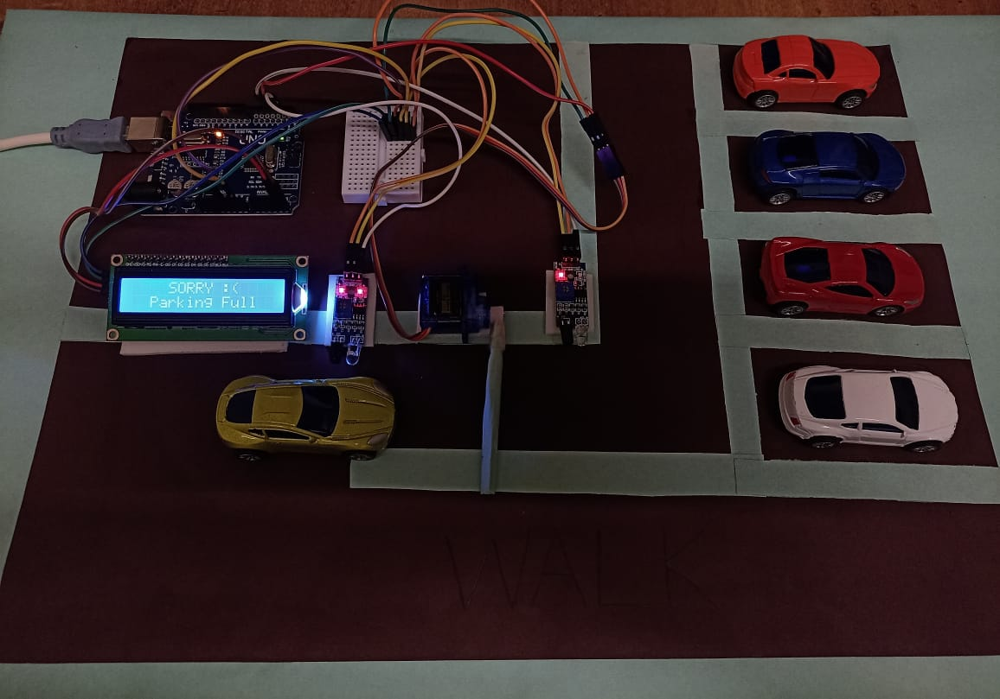

# IoT-Based Smart Car Parking System 

A mini project built using Arduino to automate car parking slot detection and gate control.

### 🔍 Overview
This system uses IR sensors to detect available slots and displays live parking status on an LCD screen.  
A servo motor operates the gate automatically based on parking availability.

### 🧰 Hardware Used
- Arduino UNO
- IR Sensors
- LCD Display (16x2)
- Servo Motor
- Breadboard, wires, power supply

### 📸 Project Image

### 📌 Features
- Real-time slot detection using sensors  
- Automatic gate control  
- LCD display showing "Parking Full" or "Slot Available"

